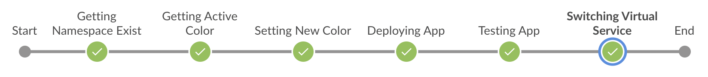

# istio-example

[](https://github.com/aramirol/istio-example/actions/workflows/blank.yml)

## What is?

[](https://github.com/aramirol/istio-example)
[](https://github.com/aramirol/istio-example)
[](https://hub.docker.com/r/aramirol/blue-green-deployment)
[](https://github.com/aramirol/istio-example/blob/main/LICENSE.md)

This repository is an example to launch a simple `blue/green deployment` based on the Istio configuration.


## How to use
### Deploy lab

To use this repo you need to clone it to your OS as following:

```sh
$ git clone https://github.com/aramirol/istio-example.git
```

### Automatically deploy

You can use `Jenkinsfile` file to automate through **Jenkins** the workflow to do a first deploy or deploy a new version of the app and change the exposed channel.



In the `Jenkinsfile`, there are three variables that are defined in the early stages and are used to calculate if it is a first run or to apply the new version in the correct color. 

| Variable         | Descruption                                             |
| ---------------- | ------------------------------------------------------- |
| **NAMESPACE_EXIST** | The value of this variable will be 0 or 1 |
| **ACTIVE_COLOR**    | Taken from the VirtualService (*blue*/*green*). If Namespace doesn't exists the value will be *white*              |
| **NEW_COLOR**       | Depending on the ACTIVE_COLOR, it will be blue, green or white | 

**NOTE**: to use `Jenkinsfile` you must be sure that your Jenkins is configured to use the `kubectl` command. If not, you can simulate the Jenkinsfile workflow using manual steps to deploy and force the switch between blue and green app.

### Manual deploy

Deploy all lab environment included into kubernetes folder using the `all.yml`:

```sh
$ kubectl apply -f kubernetes/all.yml
    namespace/blue-green-istio created
    service/myapp-service created
    gateway.networking.istio.io/myapp-gateway created
    destinationrule.networking.istio.io/myapp-destinationrule created
    virtualservice.networking.istio.io/myapp-virtualservice created
    deployment.apps/myapp-deployment-blue created
    deployment.apps/myapp-deployment-green created
```

After that, you can deploy a new version of the app and switch the virtualservice to show the default output (you have to use blue/green files alternatively):

```sh
$ kubectl apply -f kubernetes/deployment_green.yml
    deployment.apps/myapp-deployment-green configured

$ kubectl apply -f kubernetes/virtualservice_green.yml
    virtualservice.networking.istio.io/myapp-virtualservice configured
```

### Tests

After an automatically or manual deploy, you can use the scripts included into scripts folder to test the URLs. Check that the color returned by the URL changes between ***blue*** and ***green***:

```sh
$ scripts/curl_default.sh
        <h2 class="version name">Green Deployment</h2>
        <h2 class="version name">Green Deployment</h2>
        <h2 class="version name">Green Deployment</h2>
        <h2 class="version name">Blue Deployment</h2>
        <h2 class="version name">Blue Deployment</h2>
        <h2 class="version name">Blue Deployment</h2>
```

You can also do tests to the offline channel using the ***test cookie*** with this script. The return will be the same as default but adding this cookie you will see the ***offline*** version. Just the opposite value to the default:

```sh
$ scripts/curl_test.sh
        <h2 class="version name">Blue Deployment</h2>
        <h2 class="version name">Blue Deployment</h2>
        <h2 class="version name">Blue Deployment</h2>
        <h2 class="version name">Green Deployment</h2>
        <h2 class="version name">Green Deployment</h2>
        <h2 class="version name">Green Deployment</h2>
```

You can also use your web browser to navigate to the URL and see the website exposed:

 

**Note:** before use these scripts, you must modify the host and the port based in your environment. This fields must be changed into the scripts files. 
- The host is the name or IP that you use to access to your (I just use one node). *If you have a cluster, you can use the LoadBalancer IP*:
  ```sh
  kubectl get nodes -o jsonpath='{.items[0].status.addresses[0].address}'
  ```
- The port is the http port exposed throught the ingressgateway in istio-system namespace. *If you have a cluster and do not use a nodePort, you must specify the corresponding port type*:
  ```sh
  kubectl -n istio-system get service istio-ingressgateway -o jsonpath='{.spec.ports[?(@.name=="http2")].nodePort}'
  ```

## Delete Lab

To destroy all lab and clean the environment, just use the all.yml again:

```sh
$ kubectl delete -f kubernetes/all.yml
    namespace "blue-green-istio" deleted
    service "myapp-service" deleted
    gateway.networking.istio.io "myapp-gateway" deleted
    destinationrule.networking.istio.io "myapp-destinationrule" deleted
    virtualservice.networking.istio.io "myapp-virtualservice" deleted
    deployment.apps "myapp-deployment-blue" deleted
    deployment.apps "myapp-deployment-green" deleted
```

## License

MIT License

See [LICENSE](https://github.com/aramirol/istio-example/blob/main/LICENSE.md) to see the full text.
